## Module 07 - Profiling

### Performance Testing (JMeter)

/all-student

**Sebelum Optimasi (GUI)**

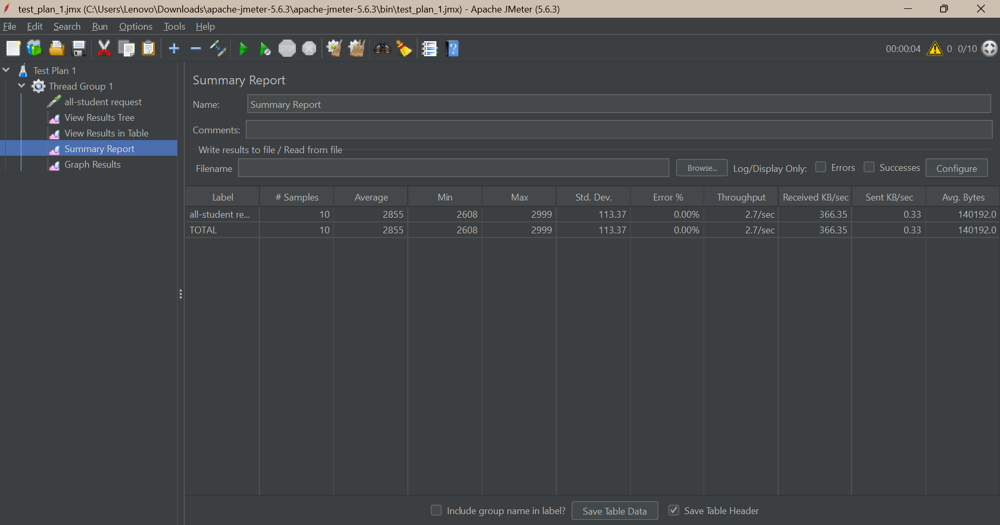

**Sebelum Optimasi (Command Line)**
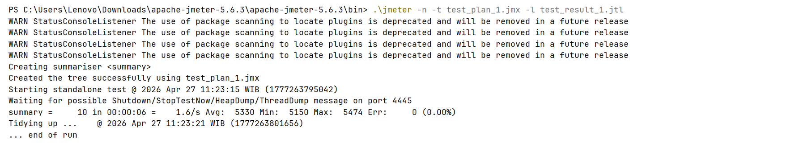

**Sesudah Optimasi (GUI)**

**Sesudah Optimasi (Command Line)**

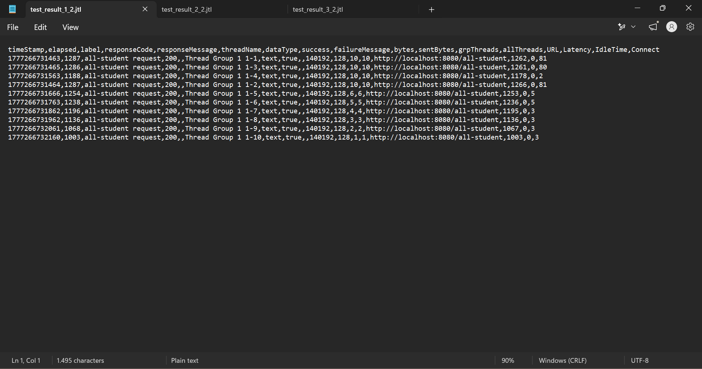

/all-student-name

**Sebelum Optimasi (GUI)**
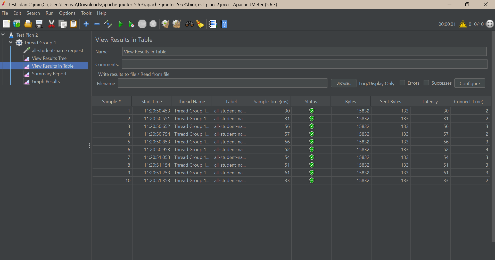
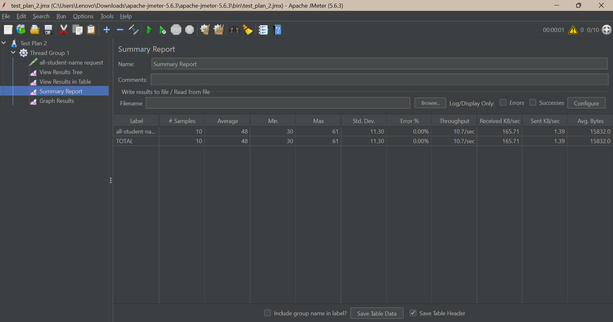

**Sebelum Optimasi (Command Line)**

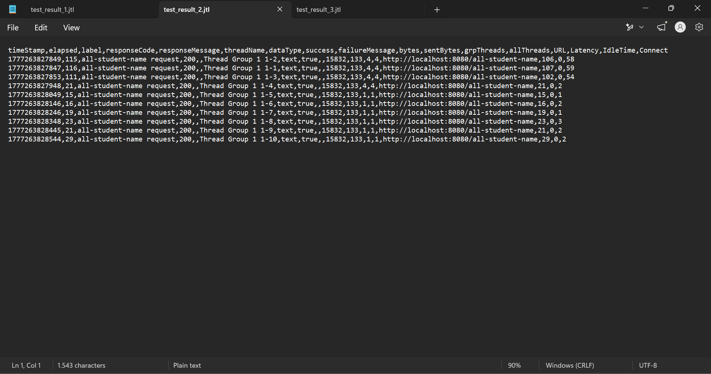

**Sesudah Optimasi (GUI)**

**Sesudah Optimasi (Command Line)**
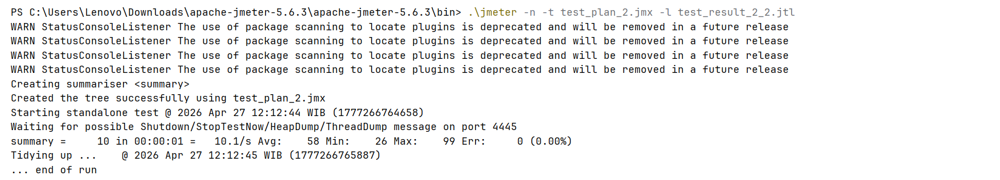
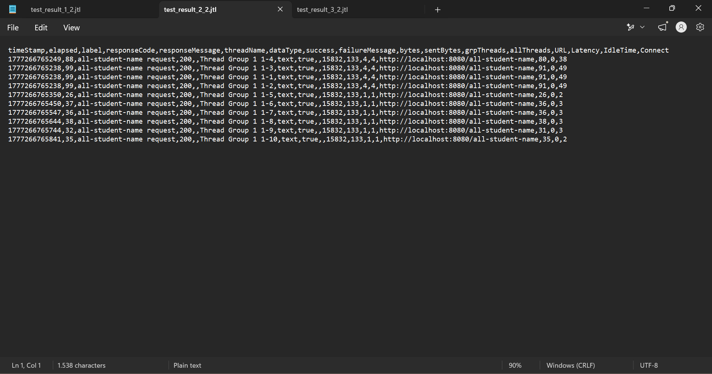

/highest-gpa

**Sebelum Optimasi (GUI)**

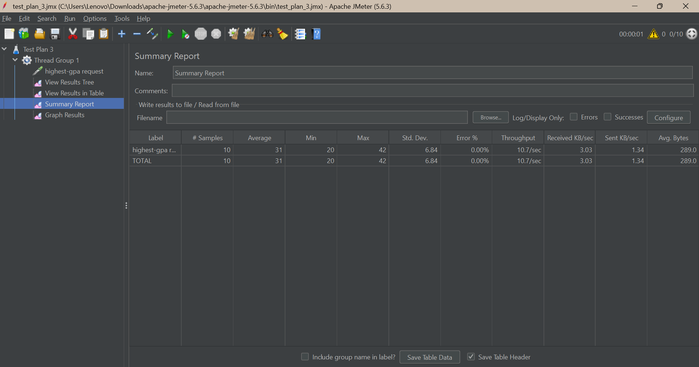

**Sebelum Optimasi (Command Line)**
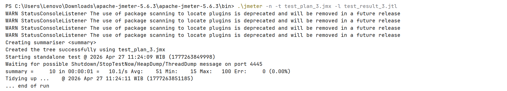
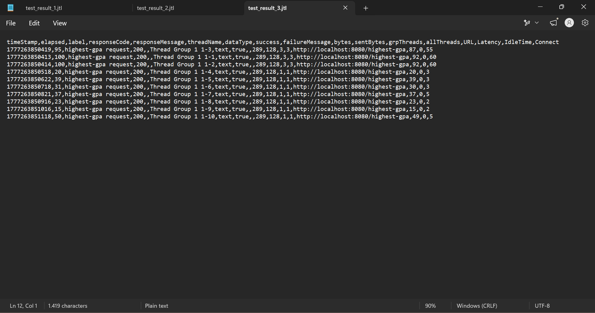

**Sesudah Optimasi (GUI)**
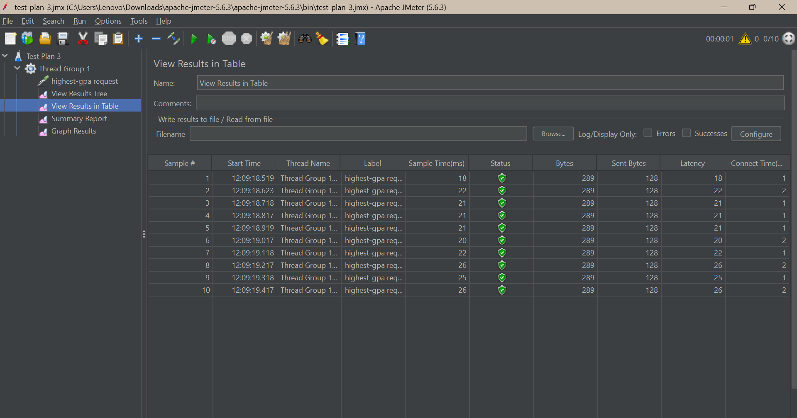

**Sesudah Optimasi (Command Line)**

### Profiling (IntelliJ) & Optimisasi

/all-student (getAllStudentsWithCourses)

Masalah: pola N+1 Query, setiap student melakukan query terpisah ke database untuk mengambil data courses-nya.

Solusi: ganti dengan satu query `findAll()` langsung ke `studentCourseRepository`.

**Sebelum**
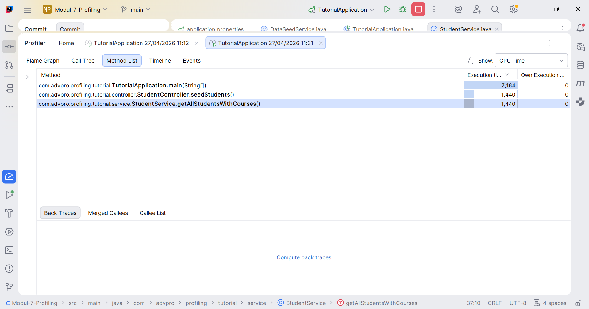

**Sesudah**
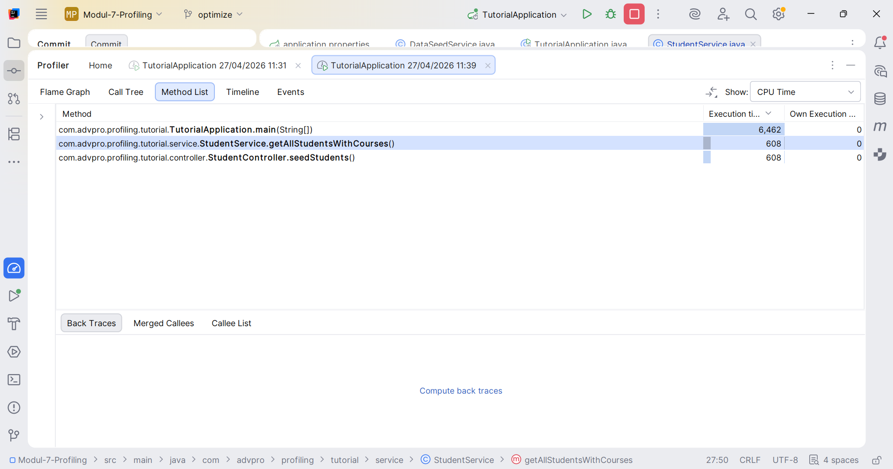

/all-student-name (joinStudentNames)

Masalah: String concatenation (`+=`) di dalam loop yang boros memory.

Solusi: ganti dengan `StringBuilder`.

**Sebelum**
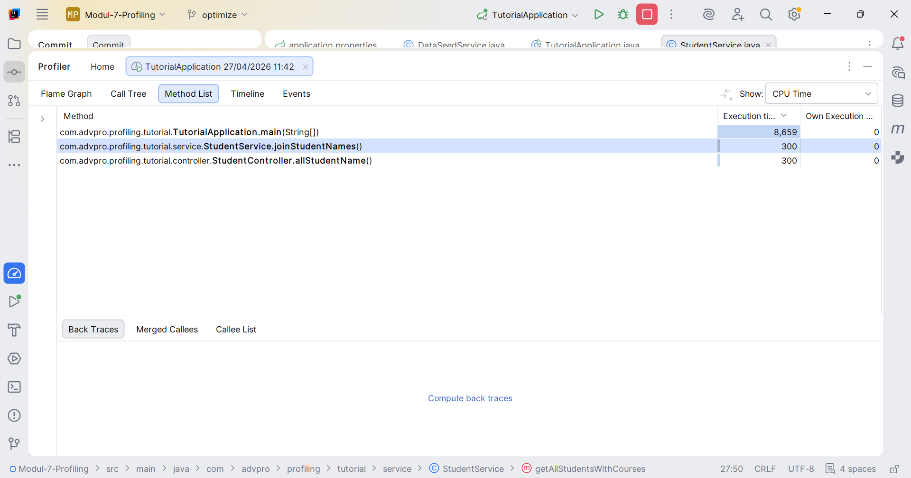

**Sesudah**
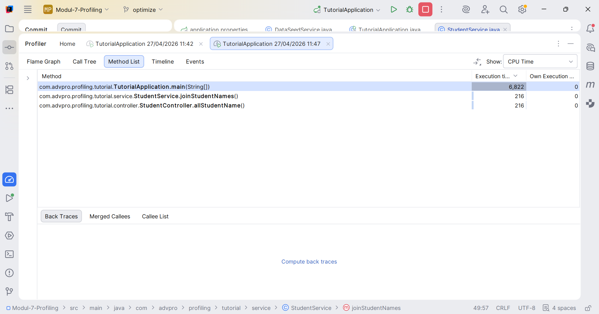

/highest-gpa (findStudentWithHighestGpa)

Masalah: manual loop untuk membandingkan GPA.

Solusi: ganti dengan Java Stream API menggunakan `max(Comparator.comparingDouble(...))`.

**Sebelum**
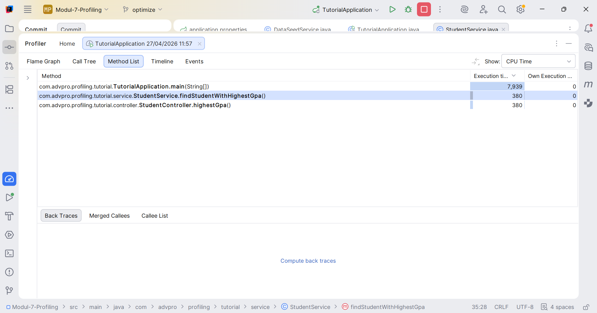

**Sesudah**
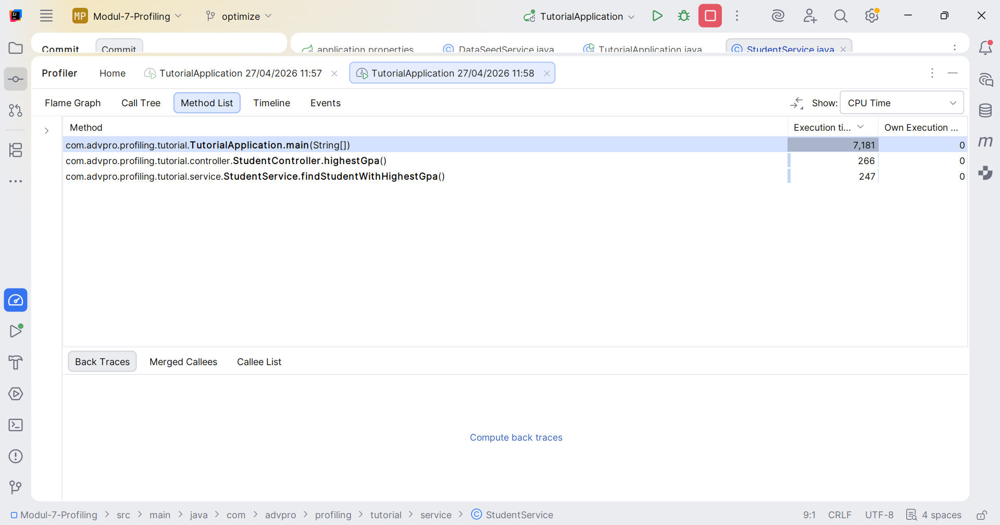

### Kesimpulan

Dari hasil performance testing ulang dengan JMeter setelah optimasi, terlihat ada peningkatan performa yang cukup signifikan terutama pada endpoint `/all-student` karena berurusan dengan jumlah query ke database. Untuk endpoint `/all-student-name` dan `/highest-gpa`, peningkatannya juga terlihat di JMeter meski tidak sedrastis `/all-student`, karena bottleneck utama kedua endpoint ini memang lebih ke efisiensi kode bukan ke database.

Hasil JMeter melalui command line kadang tidak selalu konsisten dengan hasil di GUI karena dipengaruhi kondisi sistem saat itu (JVM warm-up, load laptop, jaringan, dll). Angka dari IntelliJ Profiler bisa lebih konsisten karena lebih presisi mengukur CPU time pure dari methodnya.

### Reflection

#### 1. What is the difference between the approach of performance testing with JMeter and profiling with IntelliJ Profiler in the context of optimizing application performance?

JMeter mengukur performa dari sudut pandang user, mengsimulasikan banyak user mengakses aplikasi sekaligus dan mengukur seberapa cepat aplikasi merespons. IntelliJ Profiler masuk ke dalam kode dan mengukur berapa lama tiap method dieksekusi. JMeter untuk tahu *apakah* ada masalah performa, Profiler untuk tahu *di mana* masalahnya.

#### 2. How does the profiling process help you in identifying and understanding the weak points in your application?

Tanpa profiling, kita hanya bisa nebak-nebak bagian mana yang lambat. Dengan Flame Graph dan Method List di IntelliJ Profiler, kita bisa langsung lihat method mana yang paling banyak memakan CPU time sehingga optimasi bisa dilakukan dengan lebih tepat sasaran.

#### 3. Do you think IntelliJ Profiler is effective in assisting you to analyze and identify bottlenecks in your application code?

Efektif. Flame Graphnya mudah dipahami, method yang lebih lebar berarti lebih boros CPU. Method List juga bisa difilter dan disort berdasarkan CPU time. Ada juga fitur comparison view membantu untuk membuktikan bahwa refactoring yang dilakukan benar-benar berhasil.

#### 4. What are the main challenges you face when conducting performance testing and profiling, and how do you overcome these challenges?

Angka yang tidak konsisten antar run karena JVM butuh waktu warm-up (JIT Compiler belum optimal di run pertama). Solusinya adalah tidak menggunakan hasil run pertama sebagai patokan dan melakukan beberapa kali pengukuran.

#### 5. What are the main benefits you gain from using IntelliJ Profiler for profiling your application code?

Bisa langsung profiling dari dalam IDE tanpa setup tool eksternal. Hasilnya juga terintegrasi dengan kode, jadi bisa klik method di Flame Graph atau Method List dan langsung diarahkan ke source codenya. Selain itu, execution time tiap baris kode juga ditampilkan, jadi bisa langsung lihat lebih detail baris mana yang paling lama dieksekusi.

#### 6. How do you handle situations where the results from profiling with IntelliJ Profiler are not entirely consistent with findings from performance testing using JMeter?

Karena fokus pengukurannya beda, kalau ada yang tidak konsisten, saya tetap menggunakan hasil Profiler sebagai patokan untuk optimasi kode, dan hasil JMeter sebagai gambaran performa dari sisi user. Tapi sebelum itu cek kondisi saat pengukuran dan pastikan JVM sudah warm-up sebelum dijadikan patokan, pengukuran juga bisa dilakukan beberapa kali.

#### 7. What strategies do you implement in optimizing application code after analyzing results from performance testing and profiling? How do you ensure the changes you make do not affect the application's functionality?

Profiling dulu untuk tahu bottlenecknya, lalu optimasi dengan refactor. Setelah refactoring, aplikasi dijalankan ulang dan endpoint diakses lagi untuk memastikan hasilnya masih benar dan tidak ada error. Idealnya juga ada unit test yang bisa dijalankan setelah melakukan refactoring, tetapi pada tutorial ini tidak ada, jadi pengecekan dilakukan manual dengan mengakses endpoint dan menggunakan tools (JMeter dan IntelliJ Profiler).